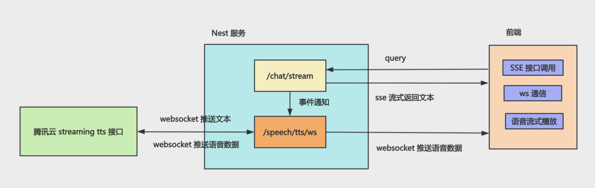

# 018 Audio TTS / ASR Demo (Hono)

这是一个基于 **Hono + LangChain.js + 腾讯云语音服务** 的语音 AI 助手示例，演示如何把以下能力串成一条完整链路：

- **ASR (Automatic Speech Recognition)**：把用户录音转换为文字。
- **LLM Streaming**：通过大语言模型生成流式回答。
- **TTS (Text-to-Speech)**：把模型输出的文本片段实时合成为语音。
- **SSE (Server-Sent Events)**：将模型生成的文本流发送给浏览器。
- **WebSocket**：双向传递 TTS 控制消息，并将二进制 MP3 音频流转发给浏览器。

## 功能点 (Features)

- 浏览器使用 `MediaRecorder` 录制麦克风音频。
- 通过 `multipart/form-data` 上传音频并调用腾讯云一句话识别。
- 支持直接输入文字提问，也支持录音后自动提问。
- 使用 LangChain 的 `PromptTemplate -> ChatOpenAI -> StringOutputParser` 组成流式调用链。
- AI 文本通过 SSE 边生成边显示。
- 同一份 AI 文本分片通过进程内 `EventEmitter` 同步送入 TTS 链路。
- 服务端维护浏览器与腾讯云 TTS WebSocket 之间的会话映射。
- 腾讯云返回的 MP3 二进制分片会实时转发到浏览器。
- 浏览器使用 `MediaSource Extensions (MSE)` 追加并播放流式 MP3。
- TTS WebSocket 会话可在连续对话中复用。
- 使用 Zod 在启动时校验环境变量。

## 完整流程 (End-to-End Flow)

```text
+---------+      microphone       +-------------------+
|  User   | --------------------> | Browser Recorder  |
+---------+                       | MediaRecorder     |
                                  +---------+---------+
                                            |
                                            | POST /speech/asr
                                            | multipart/form-data
                                            v
                                  +---------+---------+
                                  | Hono ASR API      |
                                  +---------+---------+
                                            |
                                            | SentenceRecognition
                                            v
                                  +---------+---------+
                                  | Tencent Cloud ASR |
                                  +---------+---------+
                                            |
                                            | recognized text
                                            v
+---------+      SSE text          +---------+---------+
| Browser | <--------------------- | LangChain + LLM   |
| Chat UI |   /ai/chat/stream      | streaming chain   |
+----+----+                        +---------+---------+
     ^                                       |
     |                                       | EventEmitter
     | binary MP3                            | AI text chunks
     |                                       v
     |                             +---------+---------+
     +-----------------------------| Hono TTS Relay    |
        /speech/tts/ws             +---------+---------+
        WebSocket                            |
                                             | WebSocket
                                             | ACTION_SYNTHESIS
                                             v
                                   +---------+---------+
                                   | Tencent Cloud TTS |
                                   +-------------------+
```



这里刻意把文本和音频拆成两条流：

```text
Text channel : LLM -> SSE -> browser chat message
Audio channel: LLM -> EventEmitter -> TTS WebSocket -> MP3 -> browser player
```

两条流使用相同的 `ttsSessionId` 关联。SSE 适合服务器单向推送文本；WebSocket 适合持续传输控制消息和二进制音频。

## 分步说明 (Pipeline)

### 1. 录音与语音识别 (Recording + ASR)

1. 浏览器通过 `navigator.mediaDevices.getUserMedia()` 获取麦克风。
2. `MediaRecorder` 优先录制 `audio/ogg;codecs=opus`。
3. 页面把录音放入 FormData 的 `audio` 字段，上传到 `POST /speech/asr`。
4. 服务端将音频转为 Base64，调用腾讯云 `SentenceRecognition`。
5. ASR 返回 `{ "text": "..." }`，综合页面会把识别结果作为用户问题继续发送给 AI。

### 2. AI 流式回答 (LLM Streaming)

1. 浏览器请求 `GET /ai/chat/stream?query=...&ttsSessionId=...`。
2. LangChain 将问题填入 `PromptTemplate`，调用 OpenAI-compatible Chat Model。
3. `StringOutputParser` 输出文本分片 (text chunks)。
4. 每个分片通过 SSE 发送到聊天页面并增量展示。
5. 如果请求带有 `ttsSessionId`，相同分片还会通过 `EventEmitter` 发给 `TtsRelayService`。

### 3. 流式语音合成 (Streaming TTS)

1. 浏览器连接 `WS /speech/tts/ws`，服务端生成并返回 `sessionId`。
2. AI 开始回答时，`TtsRelayService` 建立到腾讯云 TTS 的 WebSocket 连接。
3. TTS 未 ready 时，文本分片先进入 `pendingChunks` 缓冲队列。
4. 腾讯云连接 ready 后，服务端逐片发送 `ACTION_SYNTHESIS`。
5. AI 文本结束后，服务端发送 `ACTION_COMPLETE`。
6. 腾讯云返回 MP3 二进制分片，服务端原样 relay 给浏览器。
7. 浏览器通过 `MediaSource` 和 `SourceBuffer` 边接收边播放。

## 页面 (Pages)

启动后可访问：

| 页面 | 地址 | 用途 |
| --- | --- | --- |
| ASR 测试页 | `http://127.0.0.1:3000/asr.html` | 录音、上传并查看识别文字 |
| AI 语音助手 | `http://127.0.0.1:3000/asr-ai-stream.html` | 文字/语音提问、流式文本回答和流式语音播放 |

## API 与消息协议 (API & Protocol)

### HTTP / SSE

| Method | Path | 说明 |
| --- | --- | --- |
| `GET` | `/` | 健康检查，返回 `Hello World!` |
| `POST` | `/speech/asr` | 接收 FormData `audio` 文件，返回识别文字 |
| `GET` | `/ai/chat/stream` | 使用 SSE 流式返回 AI 文本；参数为 `query` 和可选的 `ttsSessionId` |

ASR 请求示例：

```bash
curl -X POST http://127.0.0.1:3000/speech/asr \
  -F 'audio=@./record.ogg'
```

响应：

```json
{
  "text": "你好，请介绍一下 Hono"
}
```

### TTS WebSocket

连接地址：

```text
ws://127.0.0.1:3000/speech/tts/ws
```

服务端可能发送以下 JSON 控制消息：

| `type` | 含义 |
| --- | --- |
| `session` | WebSocket 已注册，并携带 `sessionId` |
| `tts_started` | 本轮 TTS 已开始 |
| `tts_final` | 腾讯云已完成本轮合成 |
| `tts_error` | TTS 发生错误 |
| `tts_closed` | 会话已关闭 |

除 JSON 消息外，浏览器还会收到 MP3 格式的 binary frames。

## 本地运行 (Getting Started)

### 1. 安装依赖

在 monorepo 根目录执行：

```bash
pnpm install
```

### 2. 配置环境变量

复制示例配置：

```bash
cp apps/018-audio-tts-asr-demo-hono/.env.example \
  apps/018-audio-tts-asr-demo-hono/.env
```

配置项：

| 变量 | 说明 |
| --- | --- |
| `OPENAI_API_KEY` | OpenAI-compatible 模型服务的 API Key |
| `OPENAI_BASE_URL` | 兼容 OpenAI API 的 Base URL |
| `MODEL_NAME` | Chat Model 名称 |
| `SECRET_ID` | 腾讯云 API SecretId，用于 ASR 和 TTS |
| `SECRET_KEY` | 腾讯云 API SecretKey |
| `APP_ID` | 腾讯云账号 AppId，用于流式 TTS |
| `TTS_VOICE_TYPE` | TTS 音色 ID，默认 `502006` |
| `PORT` | HTTP 服务端口，默认 `3000` |
| `HOST` | 监听地址，默认 `127.0.0.1` |

### 3. 启动开发服务

```bash
pnpm --filter 018-audio-tts-asr-demo-hono dev
```

然后打开 `http://127.0.0.1:3000/asr-ai-stream.html`。

## 常用命令 (Scripts)

```bash
# TypeScript 类型检查
pnpm --filter 018-audio-tts-asr-demo-hono typecheck

# 单元测试
pnpm --filter 018-audio-tts-asr-demo-hono test

# E2E 测试
pnpm --filter 018-audio-tts-asr-demo-hono test:e2e
```

## 目录结构 (Project Structure)

```text
apps/018-audio-tts-asr-demo-hono/
|-- public/
|   |-- asr.html                 # ASR 单功能测试页
|   `-- asr-ai-stream.html       # 完整语音 AI 助手页面
|-- src/
|   |-- ai/
|   |   |-- ai.controller.ts     # SSE 接口
|   |   `-- ai.service.ts        # LangChain 流式调用链
|   |-- common/
|   |   `-- stream-events.ts     # AI -> TTS 进程内事件类型
|   |-- speech/
|   |   |-- speech.controller.ts # ASR 上传接口
|   |   |-- speech.service.ts    # 腾讯云一句话识别
|   |   `-- tts-relay.service.ts # TTS 会话、缓冲与 WebSocket relay
|   |-- app.module.ts            # 依赖组装、路由和静态文件
|   |-- env.ts                   # Zod 环境变量校验
|   `-- main.ts                  # HTTP / WebSocket 服务入口
|-- .env.example
`-- package.json
```

## 关键概念 (Key Concepts)

- **Speech-to-Text / ASR**：将语音输入转换为 LLM 可处理的文本。
- **Text-to-Speech / TTS**：将模型回答转换为可播放音频。
- **Streaming Pipeline**：不等待完整答案生成，而是让文本和音频分片逐步流过系统，以降低首字和首音频延迟。
- **Readiness Buffering**：TTS WebSocket 尚未 ready 时，使用 `pendingChunks` 暂存文本，连接就绪后再依次发送。
- **Session Correlation**：使用 `ttsSessionId` 关联 SSE 文本请求与 TTS WebSocket 会话。
- **Protocol Separation**：SSE 负责单向文本流，WebSocket 负责有状态控制与二进制音频流。
- **Relay / Proxy**：浏览器不直接持有云服务密钥，由 Hono 服务端完成签名、连接和数据转发。

## 注意事项 (Notes)

- 浏览器需要允许麦克风权限；除 `localhost` 外，生产环境通常需要 HTTPS 才能调用 `getUserMedia()`。
- 当前 ASR 服务固定按 `ogg-opus` 解析音频，建议使用支持 `audio/ogg;codecs=opus` 的浏览器。
- 当前 ASR 引擎类型为 `16k_zh`，主要面向 16 kHz 中文语音。
- 当前 TTS 输出为 16 kHz MP3，前端播放依赖浏览器的 `MediaSource` 和 `audio/mpeg` 支持。
- `.env` 含密钥，不应提交到版本控制。
- 这是学习示例；生产环境还应补充鉴权、限流、超时、重试、输入大小限制、日志脱敏和会话清理策略。
